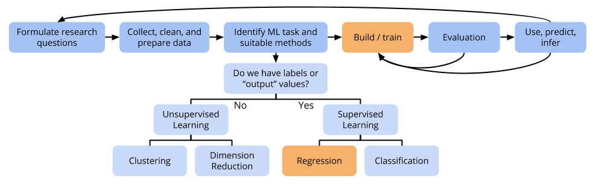

# (PART) Regression: More Flexibility {-}

# KNN & Bias-Variance Tradeoff

```{r echo=FALSE, message=FALSE}
rm(list = ls())

question_num <- 0
NextQ <- function() {
    question_num <<- question_num + 1
    question_num
}
```

## Discussion



<br>
<br>
<br>
<br>

So far our models have all looked like:

$$ y_i = \beta_0 + \beta_1 x_{i1} + \beta_2 x_{i2} + \cdots + \beta_p x_{ip} + \varepsilon $$

This is kind of a rigid assumption...can we build more **flexible** models?

<br>
<br>
<br>
<br>

**Flexibility of a method/model**

- Recall that in regression tasks, the goal is to find a good function $f(x_1,\ldots,x_p)$ that maps predictors $x_1,\ldots,x_p$ to responses $Y$
- A model has higher flexibility if it is capable of generating more possibilities for $f(X)$.
    - e.g. For linear regression, more predictors makes for more flexible models
        - There are some possibilities for $f(x_1,\ldots,x_p) = \beta_0 + \beta_1 x_1$.
        - There are more possibilities for $f(x_1,\ldots,x_p) = \beta_0 + \beta_1 x_1 + \beta_2 x_2$.
        - There are even more possibilities for $f(x_1,\ldots,x_p) = \beta_0 + \beta_1 x_1 + \beta_2 x_2 + \beta_3 x_3$.

<br>
<br>
<br>
<br>

**Parametric vs. nonparametric methods**

A way to get more flexible models is with nonparametric approaches.

- **Parametric** models have a particular form determined by **parameters**.
    - e.g. Linear regression models are determined by the $\beta$'s. (The $\beta$ coefficients are parameters.)
- **Nonparametric** models try to avoid assuming that the relationship between response and predictors looks a very particular way.
    - e.g. KNN regression tries to predict responses based on cases that have similar predictor values.
    - We'll also look at generalized additive models and tree methods.

<br>
<br>
<br>
<br>

**The bias-variance tradeoff**

Who wouldn't want a flexible method? Isn't flexibility a good thing?

- The test error of a model has both a bias and a variance component.
    - Low bias: my model is not overly simplified
    - Low variance: my model would not change very much with new training data
- When we improve one, we hurt the other...
- ...the hope is that we do this in a way that decreases test error overall
    - Usually a model with a little more bias has way less variance.


<br>
<br>
<br>
<br>


## Exercises

No R today. The focus of these exercises is entirely on conceptual understanding.

<br>
<br>

`r NextQ()`. **Bias-variance tradeoff**    
    ```
    <------------------------------------------------------------------->
    less flexible                                           more flexible
    ```
    a. Draw the diagram shown above for yourself. Add to it annotations of:    
            (more/less) bias, variance, complexity    
        (Challenge yourself to not look at the video notes.)
    b. Where would you put ordinary least squares linear regression (OLS), LASSO, stepwise selection, best subset selection, and KNN regression on this diagram? (For some of these methods, it might be best to do part c at the same time.)
    c. All of the above methods have **tuning parameters** which affect the final model that results. (For OLS, stepwise, and best subset, the number of variables included in the model can be thought of as the tuning parameter.) Add to the diagram information about low/high values of the tuning parameter.
    d. Think back to our LASSO exercises where we plotted test RMSE versus $\lambda$. This plot had a "U"-shape in which test error started high, decreased, then increased again. How is this related to the idea of "usually a model with a little more bias has way less variance"?

<br>
<br>
<br>
<br>

`r NextQ()`. **Extending KNN**
    a. Can you think of instances of where KNN algorithms come up in your day to day life?
    b. We've talked about KNN for regression. How might you adapt the KNN algorithm to work for classification (where we put cases into, say, 3 categories)?

<br>
<br>
<br>
<br>

`r NextQ()`. **Improving KNN**    
    Often machine learning algorithms can/should be modified to work well for the context in which you are working. Let's explore problems with and modifications of KNN.
    a. Looking at the following snippet of a housing dataset, compute the Euclidean distance between house 1 and 2 and between 1 and 3. (`TRUE` is numerically equivalent to 1 and `FALSE` to 0.)
        ```{r echo=FALSE, message=FALSE}
        data.frame(square_feet = c(1000,1000,1050), porch = c(TRUE,FALSE,TRUE))
        ```
    b. Do you find any problems with the distance calculations in part a? What ideas can you come up with to fix this?
    c. Write out in detail the steps of the KNN regression algorithm and try to pick out all areas in which a modification to the algorithm could be made. In what situations would the behavior of the original algorithm be undesirable, and how might you modify the algorithm to improve?


