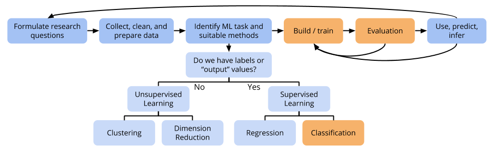

# Support Vector Machines (Part 1)

```{r echo=FALSE, message=FALSE}
rm(list = ls())

question_num <- 0
NextQ <- function() {
    question_num <<- question_num + 1
    question_num
}

knitr::opts_chunk$set(fig.width = 10, fig.height = 5, fig.align = "center")
```



## Exercises

**You can download a template RMarkdown file to start from [here](template_rmds/14-svm-part1.Rmd).**

**NOTE: completing these exercises (Part 1 today, and Part 2 on Monday) is your Homework 6, due Wednesday, April 3 at midnight. You do not need to hand in exercises that involve drawing.**

<br>
<br>
<br>

These exercises are conceptual and will guide us through thinking about the mathematical formulation of the optimization problems underlying the maximal margin classifier and the support vector classifier.

We have the following dataset of 7 cases:

```{r echo=FALSE}
toy <- data.frame(
    x1 = c(3,2,4,1,2,4,4),
    x2 = c(4,2,4,4,1,3,1),
    y = c(rep("Red", 4), rep("Blue", 3))
)
toy
plot(toy$x1, toy$x2, pch = ifelse(toy$y=="Red", "R", "B"), col = ifelse(toy$y=="Red", "firebrick", "dodgerblue"), cex = 1.5, xlab = "x1", ylab = "x2")
```

`r NextQ()`. **Maximal margin hyperplane** (related to Exercise 3 in Section 9.7 of ISLR)
    a. Sketch the maximal margin hyperplane and provide an equation for this hyperplane in the form $\beta_0 + \beta_1 x_1 + \beta_2 x_2 = 0$. (It'll be easier to write this first as $x_2 = mx_1 + b$.)
    b. Using the equation for your hyperplane, write down a classification rule for predicting "Red" and "Blue".
    c. Let $M$ be the **margin** for this hyperplane. Draw $M$ on your diagram.
    d. Label the support vectors for this hyperplane on your diagram.
    e. Would moving case 7 move the hyperplane? Why or why not?
    f. Would moving case 5 move the hyperplane? Why or why not?

<br>
<br>
<br>

`r NextQ()`. Let's keep working with the maximal margin hyperplane you drew above. But now, one more case has been added to the previous dataset: `x1 = 3, x2 = 2, y = "Red"`.
    a. Does your maximal margin hyperplane still perfectly separate the classes?
    b. Is there any hyperplane that can perfectly separate the classes?

<br>
<br>
<br>

Recall from the video that the optimization problem for a support vector classifier is as follows.

We want to find the coefficients $\beta_0, \beta_1, \ldots, \beta_p$ and values of the slack variables $\varepsilon_1, \ldots, \varepsilon_n$ in order to:

- Maximize $M$ (the margin)
- With the constraints that:
    - $\sum_{j=1}^p \beta_j^2 = 1$
    - $y_i(\beta_0 + \beta_1 x_{i1} + \cdots + \beta_p x_{ip}) \geq M(1-\varepsilon_i)$ for all $i = 1,\ldots,n$
    - $\varepsilon_i \geq 0$
    - $\sum_{i=1}^n \varepsilon_i \leq C$

<br>
<br>
<br>

`r NextQ()`. Argue that for the bigger dataset, if we use a budget $C = 2$, the original maximal margin hyperplane from Exercise 1 would still satisfy the constraints. (It may not be the hyperplane with the biggest margin though.)

<br>
<br>
<br>

`r NextQ()`. Look at [Figure 9.7](http://www-bcf.usc.edu/~gareth/ISL/Chapter9/9.7.pdf) from ISLR. (View the linked figure--don't read the caption in the book.) The solid black line is the hyperplane estimated via the support vector classifier optimization problem. The dashed lines are the margins.
    a. Order the panels in terms of lowest budget ($C$) to highest budget.
    b. How does a **high** budget relate to the following?
        - Tolerance for cases violating the margin (being on the wrong side)
        - Size of the margin
        - Number of support vectors
        - Variance of the hyperplane
        - Bias of the hyperplane
    c. `caret` and other software don't actually tend to use the budget $C$ as a parameter. They actually have a parameter called `cost` (unfortunately, also denoted with $C$). `cost` is a constant that reflects the cost to pay for a case violating the margin. How does budget relate to `cost`?
    d. How can we choose a good value for `cost`? 

<br>
<br>
<br>

`r NextQ()`. The "model" resulting from support vector methods is the equation for a hyperplane $f(x) = \beta_0 + \beta_1 x_1 + \cdots + \beta_p x_p$. For a new test case $x^*$, we normally make a classification by seeing if $f(x^*)$ is greater than or less than 0. How could we modify this thinking to generate an ROC curve for an SVM?

<br>
<br>
<br>

Extra! Read Section 9.4 of ISLR to learn about how to use SVMs for more than 2 classes.


