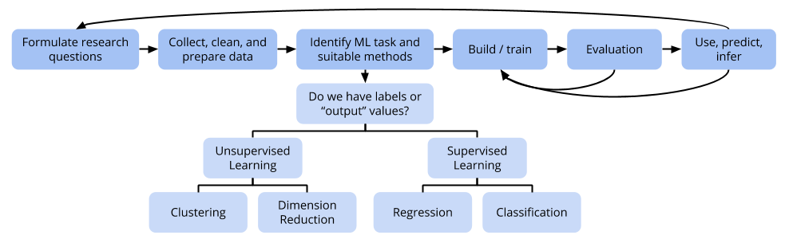

# (PART) Review {-}

# Midterm Review

[Shared Google doc for midterm review](https://docs.google.com/document/d/1lT7Qz7Lw4Q0qBv3Z5k7VlZQKtJtrPUfLS570CmmgYnM/edit?usp=sharing)

 
 

## Organizing information on all methods

For each statistical learning method that we've learned about, you might find it useful to organize information on the following aspects:

- Name of method
- How does this method work?
- How to use this method to make predictions?
- Tuning parameters
- When would I use this method? (Pros and cons)

 
 

**How does this method work?**

It is important that you understand how these different methods work from an algorithmic standpoint. If you do, you could implement them yourselves with enough familiarity with a programming language. For this part, write **rough pseudocode** describing how the method works to build the model. Try to be explicit to the level of "for every ... in ..., do the following" whenever iteration is required in the algorithm.

 
 

**How to use this method to make predictions?**

Once we have a trained model, how do we use it to make a prediction for a new test case? For regression tasks, how is a single quantitative prediction made? For classification tasks, how is a single soft or hard prediction made?

 
 

**Tuning parameters**

Tuning parameters are parameters that we can adjust to tweak these methods. How do adjustments to parameters affect model complexity, bias, variance?

 
 

**When would I use this method?**

Pros: What nice things does this method allow me to do?

Cons: But no method is perfect...do any of the themes below help us think about potential cons of the method?

 
 

**Themes**

Not all of themes relate to pros/cons, but they are different ways to think about specific methods and general behavior of methods.

- "Greedy" algorithmic behaivor
- Penalities
- Overfitting
- Bias-variance tradeoff
- Parametric vs. nonparametric methods
- Curse of dimensionality
- Training performance vs. test performance

 
 

**Methods**

- Subset selection
    - Best subset
    - Stepwise selection (forward, backward)
- LASSO
- KNN
- Splines
- Local regression (LOESS)
- GAMs
- Logistic regression
- Decision trees
- Bagged trees
- Random forests

 
 
 
 
 

## Review of specific methods

Below is a collection of assorted review ideas and practice questions (not necessarily exhaustive).

### Subset selection

Questions:

- For a dataset with 5 variables, describe in detail the forward and backward stepwise selection process. Exactly how many models are fit and compared at each stage? What about with best subset selection?

 
 

### LASSO

Questions:

- Compile a list of all the instances where we have seen penalty terms so far. Describe a common underlying framework for thinking about all of these instances.

 
 

### Splines

Review ideas:

- A natural cubic spline is a function that consists of piecewise polynomials stitched together across multiple subregions of a predictor.
    - These subregions are formed by cutting the span of the predictor at break points called **knots**.
    - The piecewise polynomials are continuous at the knots and have continuous first and second derivatives at the knots.
    - The spline function is linear in the region lower than the minimum value of the predictor variable and linear in the region higher than the amx
- If you choose to break a predictor by choosing $K$ knots, $K+1$ regions are formed, which is the **degrees of freedom (df)** tuning parameter for splines.
- The nice thing about a spline is that you can represent this spline function with a **weighted sum** of simpler polynomial functions.
    - e.g. We desire the relationship between $y$ and $x$ to be modeled with a spline with 1 knot at $x = k$. I can create a spline function to represent this relationship by adding and subtracting together a certain amount of $f_1(x) = x$, $f_2(x) = x^2$, $f_3(x) = x^3$, and $f_4(x) = (x-k)^3_+$.    
    The + in $(x-k)^3_+$ denotes the positive part. That is, $(x-k)^3_+$ equals $(x-k)^3$ when $x > k$ and equals 0 otherwise.    
    If you are curious about the math behind this look at the "Splines" chapter in the Appendix.
- These simpler polynomial functions thus define **variable transformations** of the predictor. These transformed versions of the predictors can be treated as variables like any other predictors to be included in an ordinary regression model.

 
 

### Generalzed additive models (GAMs)

Review ideas:

Instead of assuming **linear** relationships between predictors and the response...

$$\text{Outstate} = \beta_0 + \beta_1\text{PhD} + \beta_2\text{Expend} + \varepsilon$$

...let's be more general and say that the relationships can be arbitrary functions:

$$\text{Outstate} = \beta_0 + f_1(\text{PhD}) + f_2(\text{Expend}) + \varepsilon$$

- If the functions $f_1, f_2$ can be described with splines, then the model is just like an ordinary linear regression model and can be fit with least squares.
    - Let's say that we want 2 knots for each of `PhD` and `Expend`.
    - 2 knots = 3 regions = 3 degrees of freedom (df)
    - Then $f_1$ can be represented mathematically with a weighted sum of 3 simpler polynomials $a_1(\text{PhD})$, $a_2(\text{PhD})$, and $a_3(\text{PhD})$. These simpler polynomials define 3 transformed versions of the original `PhD` variable.
    - And $f_2$ can be represented mathematically with a weighted sum of 3 simpler polynomials $b_1(\text{Expend})$, $b_2(\text{Expend})$, and $b_3(\text{Expend})$. These simpler polynomials define 3 transformed versions of the original `Expend` variable.
- We can also have these functions be described with LOESS functions.
    - $f_1$ can be represented by a function drawn from local linear regressions.
    - $f_2$ can be represented by a function drawn from local linear regressions.
- Note that regardless of how $f_1, f_2, \ldots$ are built, we interpret them as how the response changes with that predictor, holding constant the other predictors.

 
 

### KNN and decision trees

Questions:

- KNN and decision trees are both nonparametric methods for regression and classification. Contrast how these models are different from parametric linear and logistic regression models.
- KNN and decision trees are both nonparametric methods, but differ in the form that they assume for the relationship between the response and the predictors. Describe this and draw a 2-dimensional (2 predictor) example to highlight the difference.
- In our ISLR book: exercises 4 and 5 in section 8.4

 
 

### Logistic regression

Questions:

- In our ISLR book: exercises 6 and 9 in section 4.7
- Can the "No Information Rate" be computed with 3 or more classes? If so, how?
- Can sensitivity, specificity, positive predictive value, and negative predictive value be defined with 3 or more classes? If so, how?
- Can ROC curves, AUC be computed with 3 or more classes? If so, how?

 
 

### Bagging and random forests

Questions:

- We've discussed bootstrap aggregating (bagging) in the context of decision trees. Could bagging apply to linear or logistic regression? How?
- Come up with a specific numerical example with a small dataset and small number of trees that fully shows how out of bag (OOB) test error is computed.

 
 

### Test set performance

Questions:

- We have mostly focused on test RMSE (regression) and test overall accuracy (classification). We have many metrics for evaluating classification models that are useful in different ways/in different contexts. There are test versions of these metrics. For example, there are notions of test sensitivity, test specificity, test AUC, test confusion matrix. How are these computed with cross-validation or an out-of-bag (OOB) procedure?

